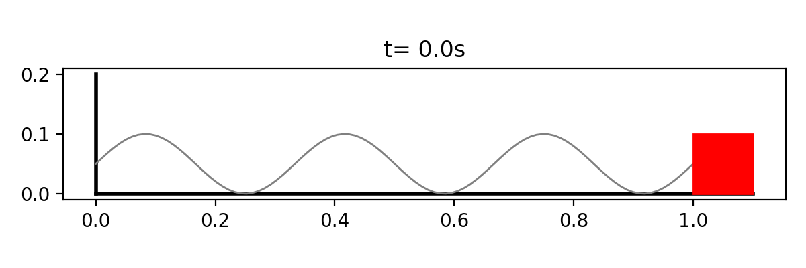

# Hybrid ODE Simulator
<p align="center"></p>

**Hybrid ODE Sim** is a Python package designed to solve systems of ordinary differential equations (ODEs) that involve both continuous and discrete dynamics. That is, dynamics of the forms:

$$
\dot{x} = f(t, x) \tag{(1) Continuous}
$$

$$
x_{k+1} = f(t_k, x_k) \tag{(2) Discrete}
\quad
$$

This solver is particularly useful for simulations that require handling events or state changes at specific points in time while integrating continuous dynamics in between these events. This commonly occurs in simulating robots and their control/planning systems. The package is meant to be very simple and leverages common numerical integrators to provide accurate and efficient solutions for hybrid systems.

## Contents

The package contains four main building blocks: `ContinuousTimeModel`, `DiscreteTimeModel`, `ModelGraph`, and `Simulator`.

### Examples
For examples of how to use different kinds of models and the simulator class, please see [the test notebooks](/hybrid_ode_sim/tests/).

### Discrete Time Models
Each `DiscreteTimeModel` is evaluated at an integral sample rate, say 5 times per second / 5 Hz. Implementing a `DiscreteTimeModel` requires overriding the function:
```python
def discrete_dynamics(self, t: float, y: Any) -> Any:
    y_next = ...
    return y_next
```
`DiscreteTimeModel` constructors are provided with an initial state `y0`, a string `name`, their integral evaluation frequency `sample_rate`, an optional `params` object, and an optional logging level.


### Continuous Time Models
Between consecutive evaluations of a `DiscreteTimeModel`, all `ContinuousTimeModel` instances are integrated simultaneously using a numerical integrator like RK4 (other integrators are available as well). Implementing a `ContinuousTimeModel` requires overriding the function:
```python
def continuous_dynamics(t: float, y: np.ndarray) -> np.ndarray:
    ydot = ...
    return ydot
```

`ContinuousTimeModel` constructors are provided with an initial state `y0`, a string `name`, an optional `params` object, and an optional logging level.

### The Model Graph

When multiple `DiscreteTimeModel` instances are to be evaluated at the same timestep (e.g. two discrete models both run at 100 Hz), the `ModelGraph` imposes the evaluation order. To indicate that a particular model `model_A` should receive feedback from / have access to the state `model_B`, we have two conventions:

1. We use the convention `model_B.inputs_to(model_A)`, where `model_B`, `model_B` are `DiscreteTimeModel`, to indicate that the directed edge `model_B -> model_A` exists in the topological sorting of the `ModelGraph` in the case that `model_B` and `model_A` are evaluated during the same timestep. The `.inputs_to` function is only to be used when `model_A` and `model_B` are both `DiscreteTimeModel`.

2. We use the convention `model_C.feedback_from(model_D)` to get access to `model_D`'s state from the dynamics function of `model_C`, but this does not impose any evaluation order.

Think of `inputs_to` as a forward edge in a Simulink model, while `feedback_from` is a reverse edge.

You may use the `self.input_models` instance member to access inputs' states. This is a dict with keys as model names (strings) and values being that model's current/most recent state.

*Note:* There is a zero-order hold on discrete system states between consecutive evaluations if the discrete model's state is queried by other systems in that in-between time.

### The Simulator

The simulator ties everything together into one class which takes as input a model graph and an option for the integrator to be used. The `Simulator` class exposes the `simulate` function which takes as input the time range (with start and end times as rational numbers via the `Fraction` type) to simulate.

## Installation

You can install `hybrid_ode_sim` as a local pip package and use the provided library as you would any other.

### Setup

Clone the repository locally:

```bash
git clone https://github.com/micahreich/hybrid_ode_sim.git  # for https
git clone git@github.com:micahreich/hybrid_ode_sim.git      # for ssh
```

Install pip requirements from the `requirements.txt`

Now, when you wish to use `hybrid_ode_sim`, ideally from within a virtual environment, just run:
```bash
pip install -e /path/to/hybrid_ode_sim # install `hybrid_ode_sim` as a pip package along with requirements
```

And that's it!

## Available ODE Solvers
### Adaptive Runge-Kutta Methods
An instance of an adaptive Runge-Kutta implementation can be provided as the integrator to a simulator. Currently implemented are RK23 and RK54, but adding other methods is as easy as providing the Butcher Tableau. Other integrators can be implemented by inheriting from the `Integrator` class.

### Fixed-Step Adaptive Runge-Kutta Methods
An instance of a fixed-step Runge-Kutta implementation can be provided as the integrator to a simulator. Currently implemented is RK4, but adding other methods is as easy as providing the Butcher Tableau. Other integrators can be implemented by inheriting from the `Integrator` class.

## Rendering
The package also includes some rendering tooling which animates the results of simulations. Matplotlib animations can be created by creating and rendering `PlotElements` which grab data from system instances. Multiple plot elements can be combined into one `PlotEnvironment`, rendered, and also saved as a video or GIF.

## TODO
- [ ] Implement zero-crossing detection for early stopping
- [ ] Benchmark performance against `scipy.solve_ivp`
